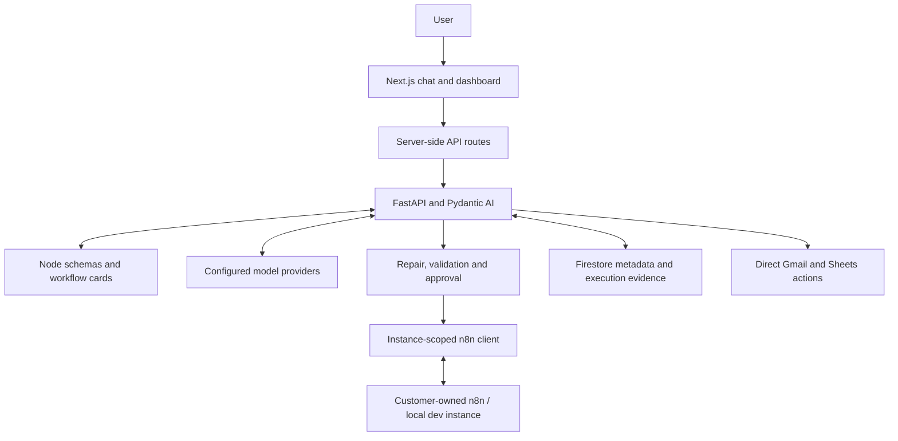

<div align="center">
  <picture>
    <source media="(prefers-color-scheme: dark)" srcset="apps/web/public/images/logo/conduut-wordmark-dark.svg">
    
  </picture>
  <h3>Build automations through conversation. Understand what happens next.</h3>
  <p>An AI-assisted operations layer for self-hosted n8n.</p>
  <p><a href="#what-you-can-do">Capabilities</a> · <a href="#how-it-works">Architecture</a> · <a href="#engineering-decisions">Engineering</a> · <a href="#local-development">Local setup</a> · <a href="#project-status">Status</a></p>
</div>

---

Conduut helps users create and manage n8n workflows through a conversational interface. It connects natural-language requests to workflow generation, validation, approval, execution history, and failure investigation in one workspace.

The central engineering question is simple: **how do you turn an AI-generated workflow into an automation a user can inspect, approve, and operate?** Conduut explores that question through native n8n JSON, deterministic repair, execution evidence, and a dashboard built around the automation lifecycle.

This is a **portfolio project and working MVP**. The repository contains the implementation and its engineering decisions. It is not currently offered as a hosted service, and the public release is not a production-readiness certification.

## What you can do

| Capability | In the application |
| --- | --- |
| Build through conversation | Describe an automation; the agent retrieves node schemas and workflow templates, then creates or updates native n8n workflows. |
| Review before execution | Inspect previews and use validation, sandbox probes, and approval gates before supported execution paths. |
| Connect your n8n instance | Register a customer-owned server, check health and compatibility, and rotate or disconnect its API access. |
| Operate workflows | Supply runtime inputs, run batches, and activate or deactivate workflows from the dashboard. |
| Investigate failures | Browse execution history and send a failed run to chat with **Fix with Conduut**, including its structured execution reference. |
| Manage integrations | Connect Google Gmail and Sheets through OAuth; configure predefined n8n credentials and custom HTTP credentials. |
| Act on connected services | Perform supported Gmail and Sheets actions directly when a reusable workflow is unnecessary. |
| Inspect results and usage | View readable result cards, saved artifacts, and recorded model/token usage. |

### Example requests

These illustrate the intended interaction, not guaranteed outputs for every account or workflow:

> “When a webhook receives a lead, append their name and email to my Google Sheet.”

> “Create a reusable email workflow with recipient, subject, and message as inputs.”

> “This run failed. Inspect the execution and help me repair the workflow.”

Credentials, permissions, required inputs, and node compatibility determine what can run. The agent can ask for missing information or return validation findings before an action proceeds.

## How it works



Firebase authentication identifies the user. The web application's server-side routes forward authenticated requests to the agent. A request-scoped resolver selects the user's active n8n instance; a shared adapter supports local development.

The agent retrieves node knowledge, produces native n8n JSON, and passes it through repair and validation logic. Previews, approval policies, and supported sandbox probes govern execution. Execution details and evidence support the result shown to the user and subsequent repair conversations.

| Mode | Purpose | Secret storage |
| --- | --- | --- |
| `shared_dev` | Local development against the bundled n8n container | Developer-managed environment configuration |
| `customer_owned` | Connect a user's own n8n server over its public API | Encrypted local files for development; Google Secret Manager required by production guards |

See the [customer-owned n8n design](knowledge-database/02-architecture/customer-owned-n8n.md) for connection checks, instance boundaries, and rollout requirements.

## Engineering decisions

### Native workflow JSON with deterministic repair

The model works with n8n's native workflow representation. Schema lookup and repair code address recurring issues such as node wiring, AI sub-node connections, and runtime-input expressions. Earlier intermediate-representation approaches are preserved as historical design decisions.

Start with [workflow repair](apps/agent/src/agent/repair.py) and the [native JSON decision](knowledge-database/03-decisions/adr-0010-json-surface-repair-normalizer.md).

### Execution evidence beyond a success flag

Assurance code combines static contracts, supported runtime probes, execution assessment, and read-back evidence. Safe/Fast policies change the validation path; coverage depends on the node and operation. Sandbox checks reduce risk but are not a universal isolation boundary or proof that every workflow is correct.

Explore [assurance](apps/agent/src/agent/assurance/), [sandbox implementation](apps/agent/src/agent/sandbox.py), and [execution evidence storage](apps/agent/src/store/execution_evidence.py).

### Customer-owned infrastructure and explicit boundaries

Instance resolution keeps n8n access tied to the authenticated user. Connection checks cover HTTPS targets, address validation, DNS handling, and supported versions. Drift checks help avoid overwriting changes made outside Conduut. Production network isolation and operational validation remain separate requirements.

See the [provider resolver](apps/agent/src/n8n_provider.py), [secret store](apps/agent/src/secret_store.py), and [BYO architecture decision](knowledge-database/03-decisions/adr-0022-customer-owned-n8n.md).

### Streaming conversations connected to operations

Server-sent events carry incremental agent output and tool activity. The dashboard connects conversations to workflows, credentials, executions, artifacts, and usage. Failed executions become structured repair context.

Explore the [agent implementation](apps/agent/src/agent/), [web application](apps/web/src/), and [execution-history design](knowledge-database/04-features/execution-history.md).

## Technology

| Layer | Stack |
| --- | --- |
| Web | Next.js 16, React 19, TypeScript, Tailwind CSS 4, Zustand |
| Backend and agent | Python 3.12, FastAPI, Pydantic AI, HTTPX, SSE |
| Identity and persistence | Firebase Authentication, Firebase Admin, Firestore |
| Automation | n8n public API, local schema and workflow-card registry |
| Model access | Server-configured provider keys and tiered model profiles |
| Development and infrastructure | Docker Compose, Windows launcher, Terraform foundation |

Model/provider choices are defined in [model_registry.py](apps/agent/src/agent/model_registry.py). Their availability may change; review the selected profile before running the application.

## Repository map

```text
apps/
  web/                 Next.js UI, authentication and API proxy routes
  agent/               FastAPI, agent tools, validation and service clients
packages/
  n8n-registry/        Schema lookup, workflow cards and retrieval index
infra/
  terraform/           Cloud foundation configuration
knowledge-database/    Architecture, decisions, scenarios and known issues
docker-compose.yml    Local n8n, agent and web service definitions
start-local-dev.bat   Windows development launcher
```

## Local development

The documented development path runs **n8n in Docker and the agent/web locally on Windows**. You need your own Firebase project, n8n API key, and model-provider credentials. No shared demo credentials are supplied.

### 1. Install dependencies

Prerequisites: Python 3.12, a Node.js version compatible with the pinned Next.js release, pnpm, and Docker Desktop with Compose. Run these PowerShell commands from a fresh clone:

```powershell
git clone https://github.com/bnrks/Conduut.git
cd Conduut
python -m venv .venv
.\.venv\Scripts\Activate.ps1
python -m pip install -e ./packages/n8n-registry
python -m pip install -e "./apps/agent[dev]"
pnpm --dir apps/web install --frozen-lockfile
Copy-Item .env.example .env
Copy-Item apps/web/.env.example apps/web/.env.local
```

### 2. Configure your services

| Configuration | Where to set it |
| --- | --- |
| Firebase web app identifiers | `apps/web/.env.local`; register a web app and enable the sign-in methods you intend to use |
| Firebase Admin credentials | Local `apps/agent/serviceAccount.json`; use a project with Firestore configured |
| Model profile and provider keys | Root `.env`; supply the providers required by `CONDUUT_MODEL_PROFILE` |
| Local n8n API key | Root `.env`, `CONDUUT_DEV_SHARED_N8N_API_KEY` |
| Optional Gmail/Sheets OAuth | Root `.env`, Google OAuth client settings and a fresh `CONDUUT_CONNECTION_ENCRYPTION_KEY` |

Keep Firebase web and Admin configuration pointed at the same project, and allow your local web domain in Firebase Authentication. The backend also supports ADC and emulator modes; see [Firebase initialization](apps/agent/src/firebase.py).

The example selects `CONDUUT_MODEL_PROFILE=deepseek`, which needs `CONDUUT_DEEPSEEK_API_KEY`. Other profiles may use multiple providers. The separate API-auth research tool uses Google model access through `CONDUUT_GOOGLE_API_KEY`.

For Google integrations, configure the OAuth consent screen, APIs, scopes, and redirect URI for your chosen local web origin. See [agent service documentation](knowledge-database/02-architecture/agent-service.md). Leave Google OAuth unset if you do not need these integrations.

### 3. Start n8n and prepare the registry

```powershell
docker compose up -d n8n
```

Open `http://localhost:6180`, complete n8n's initial setup if prompted, and create an API key. Put it in `CONDUUT_DEV_SHARED_N8N_API_KEY` in the root `.env`. A placeholder or arbitrary environment value is not a substitute for a key issued by n8n.

Once the container is healthy, generate its schema and retrieval artifacts:

```powershell
python packages/n8n-registry/scripts/fetch_nodes.py
python packages/n8n-registry/scripts/fetch_credentials.py
python packages/n8n-registry/scripts/build_cards.py --n8n-version 1.121.3
```

These commands copy schema caches from `conduut-n8n` and build cards, a search index, and a compatibility manifest. Missing or mismatched artifacts can prevent registry readiness, particularly in enforce mode. The version must match the running n8n instance.

### 4. Start the application

With the virtual environment still activated:

```powershell
.\start-local-dev.bat
```

| Service | Local URL |
| --- | --- |
| Web application | `http://localhost:3007` |
| Agent health endpoint | `http://localhost:8100/health` |
| n8n editor | `http://localhost:6180` |

Sign in with your Firebase project, then try a small workflow using test data. Close the launcher-created agent/web terminals to stop those services; run `docker compose stop n8n` to stop the local n8n container.

<details>
<summary>About the full Docker Compose stack</summary>

The repository also contains agent and web container definitions (web port `3000`). They need generated registry artifacts, Firebase configuration, and explicit model-provider environment wiring. The current Compose agent service does not forward all root model-provider settings; the web build also needs its Firebase public configuration available during the Next.js build. Review these definitions before using the full stack.

The bundled n8n configuration includes a fixed development encryption key and is intended for disposable local data. Do not use this Compose setup unchanged for a public deployment.

</details>

## Verification

After installing development dependencies, run each command from the repository root:

```powershell
pnpm --dir apps/web lint
pnpm --dir apps/web exec tsc --noEmit
python -m ruff check apps/agent
python -m ruff format --check apps/agent
python -m pytest apps/agent/tests
python -m ruff check packages/n8n-registry
python -m pytest packages/n8n-registry/tests
docker compose config --quiet
```

Automated tests cover parts of the system; they do not establish production readiness or successful execution against your accounts. See the [scenario bank](knowledge-database/06-testing/scenario-bank.md) for integration scenarios and acceptance evidence. Live checks require configured services and may make external changes.

## Project status

The public repository is shared for portfolio review and technical exploration. There is currently no hosted demo or commitment to a managed service launch.

- **Implemented:** conversational workflow generation, customer-owned connection management, validation/approval paths, execution history and repair handoff, credential management, Gmail/Sheets actions, artifacts, and usage recording.
- **Incomplete:** billing and quota enforcement, some settings/profile actions, broad OAuth coverage, and production monitoring.
- **Compatibility baseline:** n8n `1.121.3` is pinned in this codebase. Treat it as a development compatibility target, not a recommendation to expose that version publicly; upgrades require compatibility and security review.
- **Deployment:** Terraform foundation code is included. A production rollout and multi-instance pilot remain outstanding; GitHub Actions deployment automation is intentionally absent.

The [current-state note](knowledge-database/01-project/current-state.md) and [known issues](knowledge-database/07-debugging/known-issues.md) distinguish implemented behavior from planned work. Historical notes and `PROJECT.md` include earlier designs; source code and current architecture decisions take precedence.

## Further reading

- [Knowledge database](knowledge-database/index.md) — project documentation hub; notes are primarily in Turkish.
- [Architecture decisions](knowledge-database/03-decisions/) — the choices and tradeoffs behind the implementation.
- [Agent guide](AGENTS.md) — repository conventions and contribution workflow.
- [Brand guide](BRAND.md) — visual identity and typography.

## Security and license

Never submit API keys, OAuth tokens, service-account exports, real execution payloads, or private customer data in issues or screenshots. Report vulnerabilities privately as described in [SECURITY.md](SECURITY.md).

No open-source license is currently included. This repository is available for portfolio review; no additional reuse license is granted. n8n and other dependencies remain subject to their respective licenses. Conduut is an independent project and is not affiliated with n8n.
