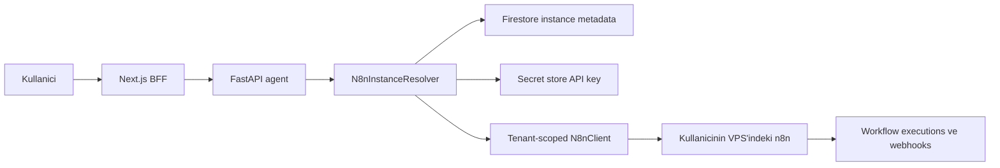

# Customer-Owned n8n (BYO n8n)

Merkez: [[index]]

## Durum

V1 kodu `codex/byo-n8n-v1` dalinda uygulandi; production pilotu ve operasyonel
rollout bekliyor (2026-08-03).

Bu not, Conduut'un production n8n calistirma modeli icin aktif hedef mimariyi
ve shared n8n MVP'den gecis planini tanimlar. Mimari karar
[[adr-0022-customer-owned-n8n]] icinde kayitlidir.

## Uygulama Ozeti (2026-08-03)

- `N8nTarget`, request-scope `N8nRequestContext`, provider resolver ve
  instance-scoped `N8nClient` tum workflow, execution, credential, readiness,
  sandbox, webhook, OAuth ve agent-tool yollarina tasindi.
- Provider modu `shared_dev | customer_owned` olarak ayrildi. Production
  `customer_owned` ve Google Secret Manager olmadan acilmaz; resolver hatasinda
  shared target'a fallback yoktur.
- `users/{uid}/n8n_instances/{instance_id}` ve user dokumanindaki
  `active_n8n_instance_id` aktif target'i tutar. Raw API key yalniz secret
  store'a gider; public API secret ref veya tam URL dondurmez.
- Local customer-owned gelistirmede `encrypted_file` secret backend'i API
  key'leri `apps/agent/.local/n8n-secrets.json` icinde Fernet ciphertext olarak
  kalici tutar; adjacent machine-local `.key` dosyasi yeniden baslatmalarda
  tekrar kullanilir ve tum `.local/` Git disindadir. Bu backend yalniz local
  test kolayligi icindir. Production guard yalniz
  `google_secret_manager` backend'ini kabul etmeye devam eder. Local
  `customer_owned + memory` de restart-loss riskini geri getirmemesi icin
  startup'ta reddedilir (2026-08-19).
- Connect/check/key rotation/disconnect ve migration endpoint'leri FastAPI ile
  Next.js BFF tarafinda uygulanmistir.
- URL preflight'i HTTPS, public DNS/IP, redirect kapatma, kritik cagri oncesi
  yeniden DNS cozumleme, health, API auth, capability ve canonical `1.121.3`
  surum kontrolunu fail-closed uygular.
- Customer-owned HTTP transport, dogrulanan public IP'yi gercek socket hedefi
  olarak pinler; orijinal hostname'i HTTP `Host` ve TLS SNI icin korur. Boylece
  DNS kontrolu ile connect arasindaki rebinding penceresi kapanir.
- Metadata, OAuth state, preview token, execution evidence ve mutation lock
  instance kimligine baglanmistir. Customer-owned instance sahiplik siniridir;
  bu instance'taki tum workflow'lar ayrica `External/Adopt` durumuna girmeden
  yonetilebilir. Mevcut baseline varsa drift overwrite edilmez.
- Credential submit/finalize icindeki workflow attach islemleri de mevcut
  metadata icin drift guard'ini kullanir; metadata yoklugu sahiplik engeli
  degildir. Google connection metadata'si
  instance-scoped document kimligiyle legacy shared ve customer-owned kayitlari
  birlikte korur; migration hedef instance'a zaten bagli credential/connection'i
  `customer_owned` olarak siniflandirir.
- Credential attach uzak n8n'de commit olduktan sonra baseline metadata yazimi
  gecici olarak basarisiz olursa islem yanlis bir `400` ile tekrar denenebilir
  gosterilmez; basarili response `workflow_sync_status=needs_reconcile` dondurur
  ve duplicate remote side-effect riski yaratmadan reconciliation'a birakir.
- Legacy migration bounded/resumable/idempotent manifest kullanir; workflow'u
  inactive yaratir, credential referanslarini temizler, read-back alir ve son
  30 gun/en fazla 10.000 sanitized execution ozetini arsivler.
- Settings icinde `Automation Server` sekmesi, baglanti/health/key
  rotation/disconnect ve chat'e gecen agent-guided kurulum girisi vardir.
  Settings ayni canonical `apps/agent/src/agent/setup_guide.py` kaynagindan
  beslenen read-only embedded kurulum rehberini de gosterir: desteklenen Ubuntu
  22.04/24.04 + x86_64 hedef matrisi, public HTTPS zorunlulugu ve onerilen
  2 vCPU/4 GB/40 GB + 2 GB swap baseline'i,
  kopyalanabilir Docker install komutlari, `/opt/conduut-n8n` compose/Caddy
  dosyalari, expected signals, troubleshooting ve safety notlari tek yerde
  yayinlanir. Deploy adimi compose ve Caddy dosyalarini kullanicinin manuel
  editor kullanmasini gerektirmeyen, sirayla calistirilabilir quoted-heredoc
  komutlariyla VPS'e yazar; `docker compose config --quiet` basarili olmadan
  stack baslatilmaz. HTTPS dogrulamasi HEAD istegi yerine n8n `/healthz` GET
  endpoint'ini kullanir (2026-08-19). Public BFF/agent endpoint'i
  `GET /api/n8n/setup-guide`
  secret-free camelCase payload dondurur; chat stage-lock akisi ayni kaynagin
  snake_case tek-adim payload'ini kullanmaya devam eder. Baglanti gerektiren
  ekranlar soft gate, chat ise `n8n_connection_prompt` kullanir.
- Guided setup V1, Ubuntu 22.04 LTS veya Ubuntu 24.04 LTS + x86_64/amd64 public
  VPS, public DNS/80/443, Conduut destek baseline'i public HTTPS + onerilen
  2 vCPU/4 GB RAM/40 GB SSD/2 GB swap ve pinned n8n `1.121.3` ile sinirlidir;
  24.04 preferred target'tir. Agent
  `setup_guide.py` canonical adimlarini okur; VPS'e SSH yapmaz ve komut
  calistirmaz. Kullanici komutlari kendi terminalinde calistirip secret
  icermeyen ciktiyi chat'e getirir. Deployment Docker Compose +
  pinned `caddy:2.10.2`, `docker.n8n.io/n8nio/n8n:1.121.3`, `N8N_PROXY_HOPS=1`,
  settings permission enforcement, runners, Istanbul timezone ve
  `N8N_WEBHOOK_URL` kullanir; 5678 public'e publish edilmez. Docker kurulumu
  official `docker.asc` + `.sources` akisini VPS'teki Ubuntu codename'ini
  dinamik okuyarak uygular; temiz Ubuntu acilisinda `unattended-upgrades`
  `dpkg` kilidini tutarsa apt install komutlari kilidi silmek veya prosesi
  oldurmek yerine en fazla 10 dakika bekler. `N8N_ENCRYPTION_KEY` yalniz VPS'teki mode 600
  `.env` icinde sessizce uretilir (2026-08-17).
- Setup conversation'i server tarafinda immutable
  `conversation_mode=automation-server-setup` olarak saklanir. Bu mod normal
  workflow/platform action tool'larini almaz; yalniz canonical setup-step ve
  safe clarification tool'lari aciktir. Stage sirasi Firestore conversation
  state'i ile server tarafinda kilitlenir. Private-key block'u veya belirgin
  password/API key/token/encryption-key assignment'i iceren mesaj, persist ya
  da model cagrisindan once `422 setup_secret_not_allowed` ile reddedilir.

Otomatik kabul kapsami iki fake tenant/origin izolasyonu, SSRF/DNS rebinding,
typed provider hatalari, OAuth ve preview binding, migration tekrar kosusu,
instance ownership/drift ve production no-fallback senaryolarini kapsar. Gercek production
acilisi icin asagidaki operasyonel maddeler tamamlanmalidir:

- Google Secret Manager IAM ve production network egress kurallari private,
  loopback, link-local, reserved ve metadata adreslerini ag seviyesinde de
  engellemelidir.
- Tracked dosyalardan kaldirilan eski local n8n API key gercek n8n arayuzunden
  rotate/iptal edilmelidir; repository degisikligi tek basina anahtari gecersiz
  kilmaz.
- Iki test kullanicisi ve iki ayri public HTTPS n8n ile pilot matrisi, log
  correlation ve browser smoke kaniti tamamlanmalidir.

## Yonetici Ozeti

Production hedefinde Conduut kullanicilar adina n8n barindirmayacak. Her
kullanici kendi VPS/cloud hesabinda kendi n8n instance'ini satin alir, kurar ve
yonetir. Conduut; kullanicinin verdigi HTTPS adresi ve iptal edilebilir n8n API
anahtariyla bu instance'a baglanan AI tabanli workflow olusturma, dogrulama,
calistirma ve izleme katmani olur.

Bu kararla:

- `conduut-n8n` local/dev ve migration test ortami olarak kalir.
- Production'da tek global `CONDUUT_N8N_URL` / `CONDUUT_N8N_API_KEY` kullanilmaz.
- Agent her istekte Firebase `user_id` -> aktif n8n instance -> `N8nTarget`
  cozumlemesi yapar.
- Workflow, execution ve n8n credential kimlikleri instance baglami olmadan
  kullanilmaz.
- Managed per-tenant container, control-plane ve node-agent aktif roadmap'den
  cikarilir; ileride ayri lisans ve mimari kararla yeniden degerlendirilebilir.

## Kararin Sinirlari

BYO modelinin urun ve lisans sinirlari sunlardir:

- VPS/cloud hesabi kullaniciya aittir ve faturayi kullanici dogrudan saglayiciya
  oder.
- n8n owner/admin hesabi, workflow'lar, credential'lar, execution verisi,
  backup ve altyapi kullanicinin kontrolundedir.
- Conduut n8n'i host etmez, yeniden satmaz, dagitmaz, white-label etmez ve n8n
  editorunu kendi arayuzune gommez.
- Kullanici Conduut API anahtarini iptal edebilir ve n8n'i Conduut olmadan
  kullanmaya devam edebilir.
- Enterprise-only n8n ozelligi gerekiyorsa ilgili lisans kullanicinin
  sorumlulugundadir.
- Conduut'un kullanici cloud hesabinda otomatik VPS/n8n provision etmesi bu
  karar kapsaminda degildir; uygulanmadan once lisans siniri yeniden teyit
  edilmelidir.

2026-08-03 tarihli repo disi n8n lisans yazismasi bu guardrail'leri
desteklemistir: tarif edilen model OEM/Embed veya yalniz API baglantisi
nedeniyle Enterprise lisansi gerektiriyor gibi gorunmemektedir. Yazisma bu
repo'da kanonik lisans kaniti olarak tutulmaz; bu not hukuki gorus veya lisans
garantisi degildir. Mimari sinirlar degisirse n8n'den yeniden yazili teyit
istenmelidir.

## Mevcut Mimari

Bugun butun kullanicilar ayni n8n instance'ina gider:

```text
Browser
  -> Next.js BFF
  -> FastAPI agent
  -> global n8n_client
  -> shared conduut-n8n
```

Baslica baglar:

- `apps/agent/src/config.py`, tek `n8n_url` ve `n8n_api_key` tutar.
- `apps/agent/src/n8n_client.py`, global settings ile tek base URL olusturur.
- `apps/agent/src/main.py`, registry'yi tek n8n URL'sinden initialize eder.
- Workflow, credential, execution, sandbox ve webhook kodu modul-global
  `n8n_client` fonksiyonlarini kullanir.
- `/api/workflows`, shared instance'taki workflow listesini user ownership
  filtresi olmadan okur.
- `docker-compose.yml`, tek n8n container ve tek volume calistirir.

Bu production BYO icin uygun degildir; ancak uygulama state'inin onemli bolumu
zaten user-scoped oldugu icin yeniden kullanilabilir.

## Mevcut Uyum Analizi

### Hazir veya uyumlu temeller

| Alan | Mevcut avantaj |
|---|---|
| Kimlik | Firebase auth her backend istegine `user_id` tasir. |
| Workflow metadata | `users/{uid}/workflow_metadata` user-scoped'dur. |
| Connections | `users/{uid}/connections` user-scoped'dur. |
| Credential metadata | `users/{uid}/credentials` user-scoped'dur; secret n8n'e yazilir. |
| Runs service | `src/executions.py` public contract'inda `user_id` zaten zorunludur. |
| Web BFF | Browser n8n'e dogrudan gitmez; Firebase token agent'a proxy edilir. |
| Agent deps | Chat run context'i `user_id` tasir; resolver anahtari olarak kullanilabilir. |
| Result/assurance | Execution DTO, sandbox assessment ve UI contract'lari provider'dan ayrilabilir. |

### Uyumlu olmayan varsayimlar

| Alan | Bugunku sorun |
|---|---|
| Client | Base URL ve API key global singleton davranisindadir. |
| Ownership | Workflow/execution ID tek basina yetkili nesne gibi kullanilir. |
| Registry | Agent startup'inda tek n8n surumunden node/credential bilgisi yuklenir. |
| Webhook | Webhook URL tek global n8n origin'inden uretilir. |
| Sandbox | Test clone'u shared n8n'de olusturulur. |
| OAuth | Google credential'i her zaman shared n8n'e enjekte edilir. |
| Credential IDs | `n8n_credential_id` instance kimligi olmadan saklanir. |
| Concurrency | Workflow mutation lock'u yalniz `workflow_id` ile anahtarlanir. |
| Health | Agent health endpoint'i kullanici instance sagligini kapsamaz. |
| Versioning | Kullanici instance'i icin desteklenen n8n surum sozlesmesi yoktur. |

## Hedef Akis



Browser veya BFF, n8n adresini ve API anahtarini tasimaz. Agent authenticated
`user_id` uzerinden aktif instance'i cozer ve tum n8n islemlerini server-side
yapar.

### Ilk baglanti akisi

1. Kullanici `Connect existing n8n` veya `Set up a new n8n` yolunu secer.
2. Yeni kurulum yolunda Conduut chat'te canonical guided setup'i acar; agent
   tek desteklenen adimi verir, kullanici terminal ciktisini geri getirir ve
   satin alma, VPS sahipligi ve komut calistirma kullanicida kalir.
3. Kullanici HTTPS n8n URL'sini ve n8n'de olusturdugu API key'i Conduut'a verir.
4. Backend URL'yi normalize eder ve guvenlik kontrolunden gecirir.
5. Backend TLS, public reachability, API auth, n8n version ve gerekli public API
   capability'lerini preflight ile dogrular.
6. Raw API key secret store'a yazilir; Firestore yalniz secret referansi ve
   secret-olmayan instance metadata'sini tutar.
7. Instance `connected` olur ve kullanicinin aktif n8n target'i olarak secilir.
8. Agent platform state, workflow, credential ve execution islemlerinde bu
   target'i kullanir.

### Normal istek akisi

1. Firebase token backend'de `user_id`'ye cozulur.
2. `N8nInstanceResolver.resolve(user_id)` aktif instance kaydini okur.
3. Secret ref uzerinden API key alinir.
4. `N8nClientFactory` istek-scope client olusturur.
5. Workflow islemi kullanicinin n8n'inde calisir.
6. Firestore metadata'ya `instance_id` ile birlikte yazilir.
7. Response mevcut web/chat contract'ini korur.

### Workflow'un bagimsiz calismasi

Aktif schedule, polling ve webhook workflow'lari kullanicinin n8n VPS'inde
Conduut kapali olsa bile calisir. Conduut yalniz workflow yonetimi, onayli
manuel run, execution history okuma ve repair icin yeniden baglanir.

## Provider Soyutlamasi

Hedef minimum contract:

```python
@dataclass(frozen=True)
class N8nTarget:
    tenant_id: str
    instance_id: str
    ownership: Literal["shared_dev", "customer_owned"]
    base_url: str
    webhook_base_url: str
    api_key_secret_ref: str
    n8n_version: str


class N8nInstanceProvider(Protocol):
    async def resolve(self, tenant_id: str) -> N8nTarget: ...
```

V1 iki provider tasir:

- `SharedDevN8nProvider`: mevcut Docker n8n'i local/dev ve migration testleri
  icin cozer.
- `CustomerOwnedN8nProvider`: Firestore + secret store kaydindan kullanicinin
  aktif instance'ini cozer.

Managed container provider bu karar kapsaminda uygulanmaz. Ileride gerekirse
ayni contract arkasina yeni bir provider olarak eklenebilir.

`n8n_client.py` transport, DTO ve hata cevirme davranisini koruyabilir; fakat
global settings okumak yerine `N8nTarget` veya acik `base_url/api_key` alir.
Ownership yalniz resolver katmaninda degil, route/service katmaninda da
fail-closed dogrulanir.

## Veri Modeli

V1 tek aktif instance kullanir; veri modeli ileride birden fazla instance'i
destekleyecek sekilde collection olarak kurulur:

```text
users/{uid}/n8n_instances/{instance_id}
```

Secret-olmayan alanlar:

```json
{
  "display_name": "Production automation server",
  "ownership": "customer_owned",
  "provider": "manual",
  "base_url": "https://automation.example.com",
  "webhook_base_url": "https://automation.example.com",
  "api_key_secret_ref": "secret-ref-only",
  "n8n_version": "detected-version",
  "compatibility_status": "supported",
  "connection_status": "connected",
  "capabilities": ["workflows", "executions", "credentials"],
  "verified_at": "timestamp",
  "last_health_at": "timestamp",
  "last_error_code": null,
  "created_at": "timestamp",
  "updated_at": "timestamp"
}
```

`users/{uid}` seviyesinde `active_n8n_instance_id` veya esdeger tekil secim
tutulur. Ilk release'te birden cok instance UI'i sunulmaz.

Mevcut kayitlara eklenmesi gereken baglam:

- Workflow metadata: `instance_id` zorunlu.
- Credential metadata: `instance_id` zorunlu; `n8n_credential_id` yalniz bu
  instance icinde anlamlidir.
- App connection: n8n'e credential enjekte ediliyorsa `instance_id` zorunlu.
- Sandbox/assurance evidence: `instance_id` ve n8n version snapshot'i.
- Execution reference: provider resolution user_id ile yapilir; canonical
  response internal olarak `instance_id` tasir.

Workflow identity pratikte `(instance_id, workflow_id)`; credential identity
`(instance_id, n8n_credential_id)` olmalidir.

Legacy shared kayitlar yalnızca bir `instance_id` backfill edilerek
customer-owned hale getirilemez. Uzak n8n workflow ve credential ID'leri yeni
instance'ta ayni nesneyi gostermeyecektir. Gecis manifest'i her kaydi su
durumlardan birine siniflandirir:

- `legacy_shared`: Halen shared development/MVP instance'ina bagli.
- `migration_required`: Customer-owned target'a aktarim veya yeniden baglanti
  bekliyor.
- `customer_owned`: Yeni instance ID ve uzak nesne ID'si dogrulanmis.
- `archived`: Tasınmayacak; gerekcesi ve salt-okunur retention karari kayitli.

Workflow migration'i shared instance'tan export -> customer-owned instance'ta
create -> yeni `(instance_id, workflow_id)` metadata yazimi olarak yapilir.
Credential secret'lari export edilmez; kullanici ilgili connection'i yeniden
authorize eder veya secret'i yeniden girer. Eski execution ID'leri yeni
instance'a tasinmaz; gerekli history snapshot'i salt-okunur saklanir ya da acik
retention karariyla arsivlenir. Belirsiz/orphan legacy kayit production
resolver'inda customer-owned gibi kabul edilmez.

## Backend Degisiklikleri

### Config ve client

- Production icin global n8n URL/API key zorunlulugunu kaldir.
- Shared global ayarlari yalniz `shared_dev` provider'a tasi.
- `N8nInstanceResolver`, `N8nClientFactory` ve typed instance hatalari ekle.
- Workflow lock anahtarini `(instance_id, workflow_id)` yap.
- Loglara `instance_id` ve ownership ekle; URL/API key yazma.

### Route ve service katmani

Asagidaki yuzeyler tenant-scoped client kullanmalidir:

- Workflow list/get/create/update/activate/deactivate/delete/run/batch.
- Execution list/detail/inspect.
- Credential schema/create/delete/attach/finalize.
- Google connection callback ve reconnect cleanup.
- Agent workflow tool'lari ve platform state.
- Sandbox clone create/activate/call/read/delete.
- Webhook run ve execution polling.

Baglanti yoksa generic 500 yerine typed durumlar dondurulur:

- `n8n_connection_required`
- `n8n_connection_unreachable`
- `n8n_auth_invalid`
- `n8n_version_unsupported`
- `n8n_capability_missing`

### Registry ve surum uyumlulugu

BYO ortaminda kullanicilar farkli n8n surumleri calistirabilir. Ilk release:

- Dar ve acik bir supported version araligi tanimlar.
- Agent registry'si her kullanici VPS'inden startup'ta cekilmez.
- Bundled node/credential katalogu desteklenen canonical n8n surumune
  sabitlenir.
- Preflight detected version'i destek matrisiyle karsilastirir.
- Bilinmeyen/yeni surum fail-open calismaz; `unsupported` veya sinirli mod olur.
- Sonraki fazda versioned registry snapshot'lari degerlendirilebilir.

## Web ve Onboarding Degisiklikleri

Yeni dashboard yuzeyi, tercihen `Automation server` gibi duz dil kullanir:

- `Connect existing n8n`
- `Set up a new n8n`
- URL ve API key formu
- API key'in n8n'de nasil olusturulacagina adim adim rehber
- Baglanti testi ve ilerleme durumlari
- Detected version / supported durumu
- Last checked ve connection health
- Rotate/reconnect/disconnect
- Advanced alanda provider ve n8n teknik detaylari

Mevcut Next.js BFF pattern'i korunur. Browser n8n'e dogrudan request atmaz ve
API key'i GET response'unda geri alamaz.

Disconnected durumda chat ve dashboard workflow yuzeyleri kullaniciyi baglanti
ekranina yonlendirir; bos liste veya genel hata gostermek yerine nedeni aciklar.

## Credential ve OAuth Akisi

- Custom/predefined credential secret'i kullanicinin n8n credential store'unda
  kalmaya devam eder.
- Firestore metadata her zaman `instance_id` tasir.
- Google OAuth callback credential'i resolver'in sectigi ayni instance'a
  enjekte eder.
- OAuth baslatma ile callback arasinda hedef `instance_id` signed state'e
  baglanir; callback aninda aktif instance degisse bile yanlis n8n'e yazilmaz.
- Instance degistirme mevcut n8n credential ID'lerini tasimaz. Kullanici
  connection'lari yeniden baglar veya ayri bir import/migration akisi kullanir.
- Kullanici instance'inda credential create API capability'si yoksa manuel n8n
  credential kurulumu icin acik fallback sunulur.

Conduut direct platform action token'lari n8n credential'larindan ayri bir veri
siniridir; bu BYO gecisinde gizlice n8n secret'i gibi ele alinmaz ve mevcut
privacy/security sozlesmesi ayrica degerlendirilir.

## Webhook ve Network

- Production'da public raw HTTP n8n URL kabul edilmez; HTTPS zorunludur.
- Kullanici n8n'inin `WEBHOOK_URL`/reverse proxy ayari preflight'ta dogrulanir.
- Conduut manuel run icin target'in `webhook_base_url` degerini kullanir.
- Conduut sabit outbound IP saglarsa kullanici firewall allowlist yapabilir.
- Uzak URL girdisi SSRF siniridir: localhost, loopback, link-local, private
  ranges, cloud metadata adresleri, DNS rebinding ve redirect-to-private
  engellenmelidir.
- Internal/private n8n baglantisi ileride ayri connector/tunnel tasarimi ister;
  V1 public HTTPS instance ile sinirlidir.

## Guvenlik Gereksinimleri

- API key browser'a geri donmez, loglanmaz ve LLM context'ine girmez.
- Raw key Firestore document'inda tutulmaz; secret manager referansi tutulur.
- Secret rotation, revoke ve disconnect davranisi idempotent olur.
- URL allow/deny validation her connect ve kritik reconnect'te yeniden yapilir.
- HTTP client redirect, timeout, response-size ve TLS kurallarini sinirlar.
- Cross-user cache veya global client bulunmaz.
- Her destructive n8n islemi authenticated user -> instance ownership zincirini
  yeniden dogrular.
- n8n security audit/capability sonucu support diagnostics'e eklenebilir; riskli
  node'lar kullanici-owned oldugu icin Conduut tarafindan her zaman
  engellenemeyecegi acikca belirtilir.

## Guvenilirlik ve Destek Modeli

BYO'da Conduut kullanici VPS'si icin SLA vermez. Hatalar kaynagina gore
ayrilmalidir:

- Conduut agent/model hatasi.
- n8n API auth/version/capability hatasi.
- Kullanici VPS/network/TLS hatasi.
- Workflow veya external provider hatasi.

Connection health kaydi yalniz son gozlemdir; uptime garantisi degildir. Support
icin secret'siz diagnostics paketi uretilmelidir: instance id, detected version,
TLS/API reachability, last error code, request correlation id ve capability
sonuclari. Workflow payload'i, credential veya execution raw data otomatik
support kaydina girmez.

Kullanici n8n editorunden workflow'u degistirebildigi icin Conduut metadata'si
drift edebilir. Update/activate/run oncesi `updatedAt` veya canonical workflow
hash'i ile drift tespiti yapilip kullaniciya acik bir uyari verilmelidir.

## Gecis Plani

### Faz 0 - Karar ve dokumantasyon

- Bu mimari notu ve ADR kabul edilir.
- Managed container hedefi deferred olarak isaretlenir.
- Production lisans sinirlari urun kabul kriterine donusturulur.

Kabul: Knowledge database ve kanonik rehber ayni aktif hedefi anlatir.

### Faz 1 - Provider seam

- `N8nTarget`, provider/resolver ve client factory eklenir.
- Mevcut global n8n `SharedDevN8nProvider` arkasina tasinir.
- Route/service/tool katmanlari acik client veya provider context alir.
- Lock/cache anahtarlari instance-scoped olur.

Kabul: Mevcut local shared n8n akisi davranis degistirmeden yeni seam uzerinden
calisir; global client'a yeni is yolu eklenemez.

### Faz 2 - Instance store ve secret siniri

- Firestore `n8n_instances` store'u eklenir.
- Secret manager secilir ve API key write-only akisi kurulur.
- Connect/preflight/health/disconnect backend endpoint'leri eklenir.
- URL/SSRF/TLS ve typed hata kontratlari test edilir.
- Legacy `workflow_metadata`, `connections`, `credentials` ve execution
  reference kayitlari icin versioned migration manifest'i ve dry-run raporu
  uretilir; hicbir eski uzak ID otomatik olarak yeni instance'a ait sayilmaz.

Kabul: Iki test kullanicisinin target'i karismaz; raw key Firestore/log/response
icinde gorunmez. Dry-run tum legacy kayitlari sayar ve her birini
`legacy_shared`, `migration_required` veya gerekceli `archived` durumuna koyar;
siniflandirilmamis kayit kalmaz.

### Faz 3 - Onboarding UI

- Existing instance connect wizard.
- Guided provider deployment linkleri.
- Health/version/capability sonucu.
- Reconnect/rotate/disconnect.
- Baglanti yok durumlari chat/dashboard'a baglanir.

Kabul: Teknik olmayan test kullanicisi dokumansiz olarak desteklenen bir n8n'i
baglayabilir; API key UI'da yeniden gosterilmez.

### Faz 4 - Workflow ve runs cutover

- Workflow CRUD/run/batch, execution history ve Fix with Conduut tenant client'a
  tasinir.
- Workflow metadata ve execution evidence `instance_id` tasir.
- Ownership kontrolleri fail-closed olur.
- Pilot kullanicinin workflow'lari export/create ile customer-owned target'a
  tasinir; eski ve yeni ID'ler migration manifest'inde eslenir.
- Legacy execution history icin salt-okunur snapshot/retention karari
  uygulanir; eski execution ID yeni origin'de sorgulanmaz.

Kabul: User A, User B'nin workflow/execution ID'sini bilse bile okuyamaz,
calistiramaz, degistiremez veya silemez. Migrated workflow sayisi manifest ve
uzak read-back ile eslesir; orphan workflow metadata sifirdir veya gerekceli
olarak `archived` durumundadir.

### Faz 5 - Credential, OAuth ve sandbox cutover

- Credential create/attach/delete/finalize target instance'a gider.
- Google OAuth state hedef instance'a baglanir.
- Sandbox clone kullanicinin instance'inda olusturulur ve temizlenir.
- Webhook base URL target'tan cozulur.
- Legacy connection/credential metadata yeni instance'a ID backfill yapmaz;
  kullanici reauthorize/re-entry sonrasinda yeni uzak credential ID ile atomik
  olarak yeniden baglanir.

Kabul: Credential ve sandbox clone cross-instance karismaz; callback aninda
aktif instance degisikligi yanlis n8n'e secret yazmaz. Migrated connection'larin
tamami yeni `instance_id` ile read-back edilir; pending/archived legacy kayitlar
UI'da acik durum gosterir.

### Faz 6 - Compatibility ve pilot

- Supported provider/setup ve n8n version matrisi yayinlanir.
- Mevcut local kullanici kaydi BYO instance baglantisi gibi migrate edilerek
  dogfood yapilir.
- Sinirli teknik kullanici pilotu baslatilir.
- Onboarding tamamlama, version mismatch, network hata ve support oranlari
  olculur.

Kabul: Production pilotunda shared n8n'e fallback yoktur; unresolved target
fail-closed olur.

### Faz 7 - Shared production yolunu kapatma

- Shared provider yalniz development/test environment'ta etkin kalir.
- Production config shared URL/API key ile baslamayi reddeder.
- Migration manifest'i tamamlanir; `migration_required` veya siniflandirilmamis
  kayit kalmadan legacy shared production erisimi kapatilir.

Kabul: Production user request'leri yalniz `customer_owned` target ile n8n'e
gidebilir. Migration toplam sayilari source inventory, yeni uzak read-back ve
archived kayitlarla mutabiktir.

## Test ve Kabul Matrisi

| Senaryo | Beklenen kanit |
|---|---|
| Iki kullanici / iki fake n8n | CRUD ve executions dogru origin'e gider. |
| Tahmin edilen yabanci workflow ID | 404/403 fail-closed; uzak instance'a call yok. |
| Yanlis API key | Typed auth invalid; secret redacted. |
| Kapali VPS | Typed unreachable; Conduut 500 ayrimi korunur. |
| Unsupported n8n version | Workflow write/activate engellenir. |
| HTTP/private/metadata URL | Connect asamasinda reddedilir. |
| DNS rebinding/redirect | Private target'a takip edilmez. |
| OAuth sirasinda aktif instance degisimi | Credential signed state'teki instance'a gider. |
| Sandbox test | Clone ayni instance'ta olusur ve her sonuc yolunda silinir. |
| Instance disconnect | Sonraki n8n islemi connection-required olur. |
| Workflow editor drift | Update/run oncesi tespit ve kullanici uyarisi. |
| Secret rotation | Eski key kullanilmaz; raw key loglanmaz. |

## Feature Flag ve Rollback

Gecis sirasinda provider modu environment bazli acik olmalidir:

```text
development/test -> shared_dev veya customer_owned
production       -> customer_owned
```

Production'da bir kullanicinin resolver hatasinda shared n8n'e sessiz fallback
yapilmaz. Rollback, eski kodu shared production'a acmak degil; BYO feature'i
pilot kullanicilar icin durdurmak veya onceki customer-owned surume donmektir.

## Uygulama Etki Haritasi

### Agent/backend

- `src/config.py`
- `src/n8n_client.py`
- `src/main.py`
- `src/executions.py`
- `src/routes/workflows.py`
- `src/routes/executions.py`
- `src/routes/credentials.py`
- `src/routes/connections.py`
- `src/agent/platform_state.py`
- `src/agent/sandbox.py`
- `src/agent/tools/factory.py`
- `src/agent/tools/readiness.py`
- `src/agent/tools/workflow_runner.py`
- Firestore store package'i ve yeni instance store'u

### Web

- Yeni automation-server/n8n connection dashboard sayfasi
- Yeni BFF route'lari
- Chat connection-required karti/durumu
- Workflow/runs/credentials sayfalarinda connection health hata yuzeyi

### Registry

- Supported n8n version metadata'si
- Canonical/versioned node ve credential snapshot stratejisi
- Startup'taki global live-n8n bagimliliginin kaldirilmasi

### Infra

- Root Docker Compose local shared dev ortami olarak kalir.
- Conduut control-plane/node-agent gelistirmez.
- Agent icin secret manager ve sabit outbound network politikasi gerekir.

## Acik Kararlar

- Production V1 secret backend'i Google Secret Manager'dir; IAM ve gercek
  deployment kurulumu pilot oncesi tamamlanmalidir. `encrypted_file` yalniz
  local development adapter'idir.
- Ilk supported n8n minimum/maximum surumu.
- Ilk desteklenen hosting/provider rehberleri.
- Tek kullanici icin birden fazla n8n instance UI'i ne zaman acilacak?
- Kullanici-owned private network instance'lari icin tunnel/connector gerekecek
  mi?
- Guided deployment yalniz external provider linki mi olacak, yoksa
  kullanicinin cloud hesabinda otomasyon mu? Ikinci secenek lisans ekibine tekrar
  sorulmalidir.
- Workflow drift'te Conduut degisikligi overwrite mi edecek, import mu edecek,
  yoksa onay mi isteyecek? Varsayilan fail-closed/onay olmalidir.

## Basari Olcutleri

- Cross-user n8n call kaniti sifir.
- Production'da global/shared n8n fallback sifir.
- Raw n8n API key'in Firestore, log, browser response ve LLM context'inde
  gorunmesi sifir.
- Desteklenen kullanicilar icin connect wizard tamamlama orani olculebilir.
- Version/TLS/auth/network hatalari birbirinden ayrilabilir.
- Workflow, credential, OAuth, sandbox ve execution isleminde canonical
  `instance_id` lineage'i vardir.

## Ilgili Notlar

- [[adr-0022-customer-owned-n8n]]
- [[adr-0001-shared-n8n-mvp]]
- [[system-architecture]]
- [[agent-service]]
- [[execution-history]]
- [[adr-0003-google-oauth-broker-mvp]]
- [[adr-0012-custom-http-credentials]]
- [[adr-0015-predefined-credential-library]]
- [[known-issues]]
